```python
import time
from loguru import logger

tik = time.perf_counter()

SLOW_TIME = 10

def slow_sum(numbers):
    logger.info('Begin: Summation')
    time.sleep(SLOW_TIME)  # Simulate a time-consuming operation
    logger.info('End: Summation')
    return sum(numbers)

def some_other_slow_operation():
	logger.info('Begin: Slow Op')
	time.sleep(SLOW_TIME//2)
	logger.info('End: Slow Op')

class Sum:
    def __init__(self, numbers):
        self.numbers = numbers
        self.result = slow_sum(numbers)
        logger.info('Summing started and ended')
    
numbers = list(range(1, 1001))  # A large list of numbers
o = Sum(numbers)
some_other_slow_operation()
logger.info(f"The sum is: {o.result}")  # This will wait for the sum calculation if it's not done yet
tok = time.perf_counter()
logger.info(f'Total time for all operations: {tok-tik:.2f}s')
```


```python
import threading
import time
from loguru import logger

tik = time.perf_counter()

SLOW_TIME = 10

def slow_sum(numbers):
    logger.info('Start of summing')
    time.sleep(SLOW_TIME)  # Simulate a time-consuming operation
    logger.info('End of summing')
    return sum(numbers)
    
def some_other_slow_operation():
	logger.info('Start of a different operation')
	time.sleep(SLOW_TIME//2)
	logger.info('End of a different operation')

class AsyncSum:
    def __init__(self, numbers):
        self.numbers = numbers
        self._result = None
        self.result_thread = threading.Thread(target=self.calculate_sum)
        self.result_thread.start()
        logger.info('Summing already started but didn\'t end')
    
    def calculate_sum(self):
        self._result = slow_sum(self.numbers)
    
    @property
    def result(self):
        if self._result is None:
            self.result_thread.join()
        return self._result

numbers = list(range(1, 1001))  # A large list of numbers
o = AsyncSum(numbers)
some_other_slow_operation()
logger.info(f"The sum is {o.result}")  # This will wait for the sum calculation if it's not done yet
tok = time.perf_counter()
logger.info(f'Total time for all operations: {tok-tik:.2f}s')
```

---

```mermaid
gantt
title 37061ms
dateFormat x
axisFormat %L
  side__10__200        :side__10__200, 0, 1544ms
  front__50__200        :front__50__200, 1544, 7721ms
  rear__20__200        :rear__20__200, 9265, 3089ms
  side__10__400        :side__10__400, 12354, 3088ms
  front__50__400        :front__50__400, 15442, 15442ms
  rear__20__400        :rear__20__400, 30884, 6177ms
```

```mermaid
gantt
title 23164ms
dateFormat x
axisFormat %L
  side__10__200        :side__10__200, 0, 1545ms
  rear__20__200        :rear__20__200, 1, 3088ms
  front__50__200        :front__50__200, 1, 7721ms
  side__10__400        :side__10__400, 7722, 3088ms
  rear__20__400        :rear__20__400, 7722, 6177ms
  front__50__400        :front__50__400, 7722, 15442ms
```

```mermaid
gantt
title 15441ms
dateFormat x
axisFormat %L
  side__10__400        :side__10__400, 0, 1545ms
  rear__20__400        :rear__20__400, 1, 3088ms
  side__10__400        :side__10__400, 1, 3089ms
  rear__20__400        :rear__20__400, 2, 6176ms
  front__50__400        :front__50__400, 1, 7721ms
  front__50__400        :front__50__400, 2, 15439ms
```








